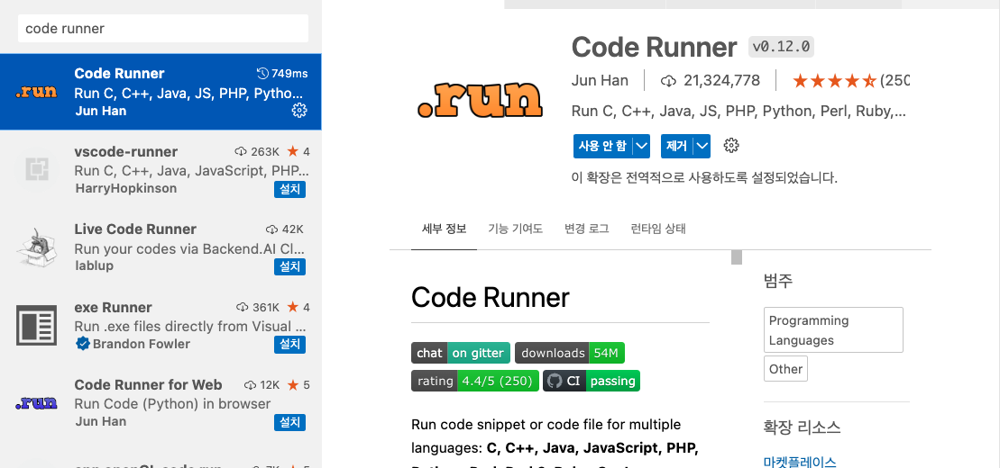
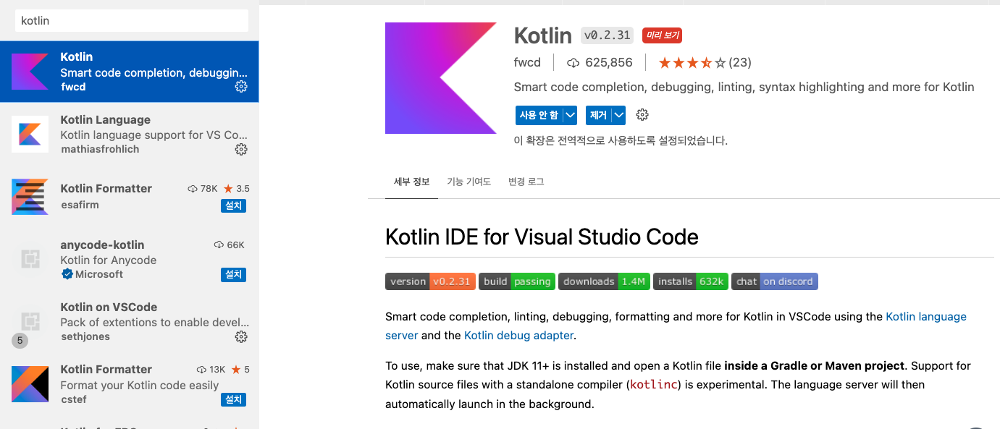
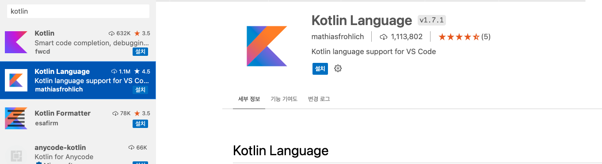
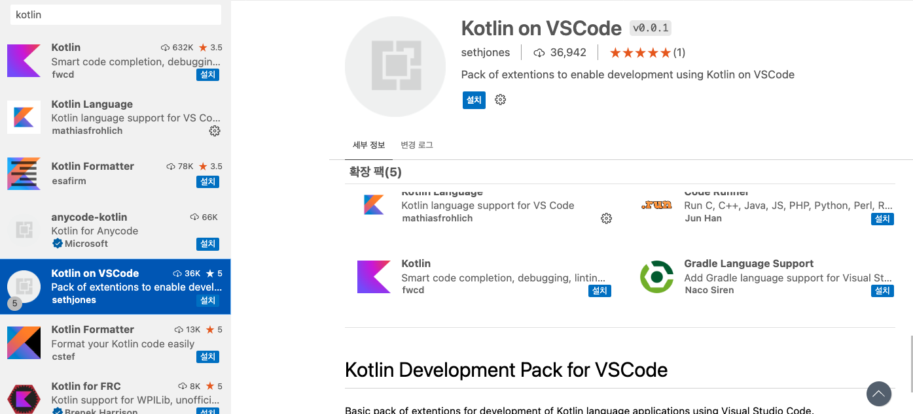
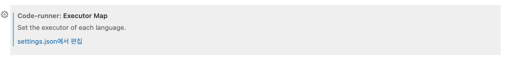

# VSCode에서 Kotlin 실행하기 

## Extension 설치하기 

- 우리가 필요한 extension은 Code Runner 라는 익스텐션이다. 이를 설치해주자. 



### 기타 kotlin 익스텐션

- 다음 확장 프로그램을 설치해주자. 
  
- Kotlin 
  - vscode를 위한 IDEA도구 
  


- Kotlin Langualge
  - 코틀린 언어 지원 도구 



- Kotlin on VSCode
  - 확장팩에 의해서 자동으로 설치됨 



## 환경 세팅하기 

- cmd + ',' 를 클릭하여 Preference 를 연다. 
- 그리고 code runner 를 검색한다. 
- 'Code-runner: Executor Map' 항목에서 settings.json에서 편집을 클릭한다. 



```js
"code-runner.executorMap": {
        "kotlin": "/opt/homebrew/bin/kotlinc $fileName -include-runtime -d $fileNameWithoutExt.jar && java -jar $fileNameWithoutExt.jar",
        "javascript": "node",
        "java": "cd $dir && javac $fileName && java $fileNameWithoutExt",
    
```

- "kotlin": ... 부분을 작성한다. 
- /opt/homebrew/bin/kotlinc 는 kotlin 컴퍼일러의 경로를 작성해주면 된다. 

## 코드 작성 및 테스트

- 01.HelloWorld.kt 파일을 다음과 같이 작성한다. 

```kt
fun main(args: Array<String>) {
  println("Hello Kotlin.")
}
```

- 그리고 .kt 파일에서 "오른쪽 클릭 > Run Code" 를 클릭한다. 

```sh
[Running] cd "/Users/xxx/KOTLIN/kotlin-tutorial-with-kido/01.BASIC/samples/" && pwd &&  /opt/homebrew/bin/kotlinc 01.HelloWorld.kt -include-runtime -d 01.HelloWorld.jar && java -jar 01.HelloWorld.jar
/Users/xxx/KOTLIN/kotlin-tutorial-with-kido/01.BASIC/samples

01.HelloWorld.kt:1:10: warning: parameter 'args' is never used
fun main(args: Array<String>) {
         ^

Hello Kotlin.

```

- 위와 같이 정상적으로 결과가 출력 되었다. "Hello Kotlin." 이 출력된 것을 확인할 수 있다. 
- 워닝의 경우 아규먼트가 있지만 사용되지 않은경우 kotlin 컴파일러는 경고를 주고 있음을 파악하자. 