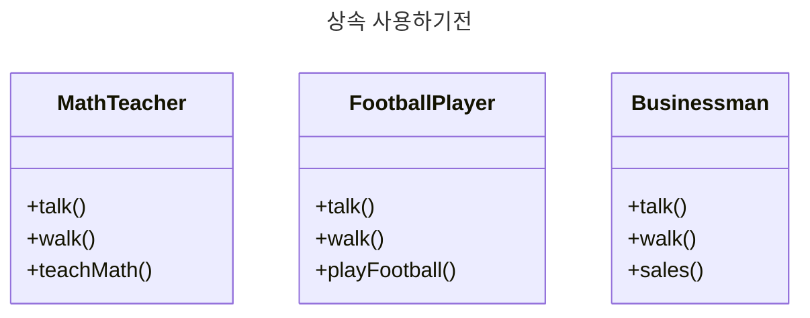
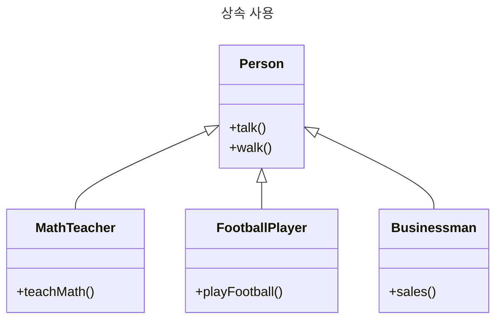

# Inheritance

- 상속은 객체지향 프로그래밍의 중요한 기능중 하나이다. 
- 이는 기존에 존재하는(베이스 클래스) 로부터 새로운 클래스를 생성할 수 있도록 한다. 
- 상속받는 객체는 베이스 클래스의 모든 기능을 상속 받는다. 

## 상속

- 상속은 클래스의 공통적인 속성을 기본속성으로 하고, 구체화가 필요한 클래스를 베이스 클래스로 부터 상속받고, 추가 속성 및 기능을 추가하는 것을 말한다. 



- 위 코드는 3개의 클래스를 가진다. 
- 모두 동일한 메소드는 talk(), walk() 메소드이다. 
- MathTeacher는 teachMath() 메소드를 가지고 있으며, FootballPlayer는 playFootball() 메소드를 가지고 있다. Businessman은 playFootball() 메소드를 가진다. 
- 이를 상속을 이용해서 분리해보자. 



- 위 그림은 Person을 기본 클래스로 하고, 이를 상속한 MathTeacher, FootballPlayer, Businessman 클래스를 지정했다. 
- 상속을 받은 클래스는 기본 클래스의 속성과 메소드를 그대로 상속받고, 자신에게 필요한 속성과 함수를 추가한 것을 알 수 있다. 

## 상속 구현하기 

- 03.01.class_inheritance.kt 파일을 생성하고 다음과 같이 작성하자. 

```kt
open class BasePerson(_name: String, _age: Int) {

  val name: String = `_name`
  val age: Int = _age

  fun talk() {
    println("안녕하세요. 제 이름은 $name 이고, $age 입니다.")
  }
}

class MathTeacher(name: String, age: Int): BasePerson(name, age) {
  fun teachMath() {
    println("Teach Math.")
  }
}

class FootballPlayer(name: String, age: Int): BasePerson(name, age) {
  fun playFootball() {
    println("Play Football..")
  }
}

class Businessman(name: String, age: Int): BasePerson(name, age) {
  fun sales() {
    println("Sale.. Goods.")
  }
}

fun main(args: Array<String>) {
  val person01 = MathTeacher("Cane", 30)
  person01.talk()
  person01.teachMath()

  val person02 = FootballPlayer("Son", 33)
  person02.talk()
  person02.playFootball()
  
  val person03 = Businessman("Smith", 40)
  person03.talk()
  person03.sales()
}
```

- 결과는 다음과 같다. 

```kt
안녕하세요. 제 이름은 Cane 이고, 30 입니다.
Teach Math.

안녕하세요. 제 이름은 Son 이고, 33 입니다.
Play Football..

안녕하세요. 제 이름은 Smith 이고, 40 입니다.
Sale.. Goods.
```

## 상속 받는 객체가 더 많은 필드를 기본 생성자로 사용한경우 

- 03.01.class_inheritance.kt 파일을 다음과 같이 작성하자. 

```kt
open class Person(name: String, age: Int) {
  init {
    println("Person $name, $age.")
  }
}

class FootballPalyer(name: String, age: Int, club: String) : Person(name, age) {
  init {
    println("Footballplayer name: $name, age: $age and club: $club ")
  }

  fun playFootball() {
    println("Play Football")
  }
}

fun main(args: Array<String>) {
  val person01 = FootballPalyer("Min", 25, "Seoul")

}
```

- 출력 결과는 다음과 같다. 

```kt
Person Min, 25.
Footballplayer name: Min, age: 25 and club: Seoul 
```

- 즉 축구 선수는 이름, 나이, 클럽 속성을 가지고 있으며, 기본 생성자를 이용할때 수퍼클래스인 Person 의 초기화 정보를 상속 받는다. 이름과 나이가 수퍼 클래스의 속성이다. 

## 보조 생성자를 이용하는 경우 

- 기본 생성자가 존재하지 않는다면 보조 생성자를 이용할 수 있다. 
- 03.03.class_inheritance.kt 파일을 다음과 같이 작성하자. 

```kt
open class Person {

  var name: String = ""
  var age: Int = 0

  constructor(_name: String) {
    this.name = name

    println("Person $name $age")
  }

  constructor(_name: String, _age: Int) {
    this.name = _name
    this.age = _age

    println("Person $name $age")
  }
}

class FootballPlayer : Person {

  constructor(_name: String) : this(_name, 10) {

  }

  constructor(_name: String, _age: Int) : super(_name, _age) {

  }

  fun playFootball() {
    println("Play Football")
  }
}

fun main(args: Array<String>) {
  val person01 = FootballPlayer("Cane")
  val perosn02 = FootballPlayer("Son", 30)
}
```

- 결과는 다음과 같다. 

```kt
Person Cane 10
Person Son 30
```

- 즉 person01 은 보조 생성자 주 이름 파라미터가 1개인 생성자를 호출했다. 그러므로 나이가 10으로 설정되었다. 
- person02 는 이름, 나이를 모두 사용하는 생성자를 사용하고 있음을 알 수 있다. 

## 함수 오버라이딩 하기 

- 상속받는 자식 클래스가 부모 클래스의 함수를 그대로 사용하지 않고 새롭게 재 정의하고자 하는 경우 동일한 함수 시그니처를 사용하면 오버라이딩 할 수 있다. 
- 다만 이때 부모 클래스의 함수를 open 으로 열어 두어야 상속을 받을 수 있다. 
- 상속을 받을때는 override 키워드를 사용해야한다. 
- 03.04.class_inheritance.kt 파일을 다음과 같이 작성하자. 

```kt
open class Person() {
  open fun speakAge(age: Int) {
      println("I'm $age years old.")
  }
}

class SuperStar: Person() {

  override fun speakAge(age: Int) {
      println("I'm ${age - 5} years old officially. ")
  }
}

fun main(args: Array<String>) {
  val superstar = SuperStar()
  superstar.speakAge(31)
}
```

- 기본 생성자에서 displayAge 함수를 open으로 열어 두었다. 
- 그리고 상속받는 클래스 SuperStar 에서는 override 를 이용하여 기본 클래스의 함수를 오버라이드 했다.
- 결과는 다음과 같다. 

```kt
I'm 26 years old officially.
```

## Getter/Setter 를 변경하기

- kotlin은 기본적으로 프로퍼티에 대해서 getter/setter를 지원하므로 별도로 작성할 필요가 없다. 
- 그러나 getter과 setter를 특정 용도에 따라 재 작성해야할 수도 있다. 
- 이럴때 다음과 같이 작성할 수 있다. 
- 03.05.class_inheritance.kt 파일을 다음과 같이 작성하자. 

```kt
open class Person() {
  open var age: Int = 0
      get() = field

      set(value) {
          field = value
      }
}

class SuperStar: Person() {

  override var age: Int = 0
      get() = field

      set(value) {
          field = value - 5
      }
}

fun main(args: Array<String>) {

  val superstar = SuperStar()
  superstar.age = 31
  println("I'm ${age - 5} years old officially. ")
}
```

- 속성 바로 다음에 get() 과 set(파라미터) 형식으로 재 정의 할 수 있다. 
- 결과는 다음과 같다. 

```kt
I'm 26 years old officially. 
```

## 부모 클래스의 함수를 자식에서 직접 참조하여 호출하기 

- 함수를 오버라이드 하는 경우 부모의 함수를 그대로 호출해야할 수도 있다. 
- 이때 super 참조자를 이용하여 부모의 함수를 호출할 수 있다. 

- 03.06.class_inheritance.kt 파일을 다음과 같이 작성하자. 

```kt
open class Person() {
  open fun speakAge(age: Int) {
    println("I'm $age years old.")
  }
}

class SuperStar: Person() {

  override fun speakAge(age: Int) {
      super.speakAge(age)
      
      println("I'm ${age - 5} years old officially. ")
  }
}

fun main(args: Array<String>) {
  val superstar = SuperStar()
  superstar.speakAge(31)
}
```

- 위와 같이 Girl이라는 자식 클래스가 displayAge 함수를 오버라이드 했다. 
- 그리고 displayAge 에서 부모의 동일한 이름의 displayAge 함수를 호출할때 super.displayAge 로 메소드 호출을 하고 있다. 
- 결과는 다음과 같다. 

```kt
I'm 31 years old.
I'm 26 years old officially.
```

## WrapUP

- 지금까지 상속에 대해서 알아 보았다. 
- 기본 생성자를 이용할때, 보조 생성자를 이용할때 조금 다르게 상속이 구현됨을 알 수 있다. 
- 또한 메소드 오버라이드, get/set 을 재정의 하는 방법역시 알아 보았다. 

- 위 샘플은 https://www.programiz.com/kotlin-programming/inheritance 에서 참조했다. 