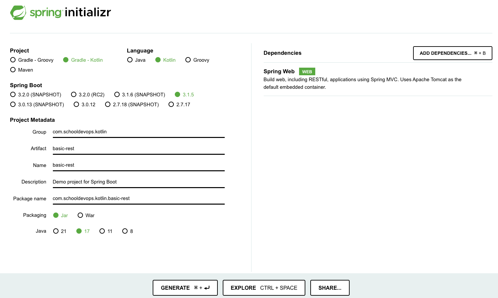

# Basic REST API 개발

- kotlin으로 REST API를 개발하기 위해서 우선 프로젝트 생성부터 진행하자.

## 프로젝트 생성 

- https://start.spring.io 에서 다음과 같이 프로젝트 설정을 잡고 개발을 수행한다. 



- Project:
  - Gradle-Kotlin 으로 프로젝트 관리 언어를 선택한다. 
- Language: 
  - Kotlin을 선택하자. 
- Spring Boot:
  - 3.1.5 를 선택하자. 현재 안정된 최신 버젼이다. 
- Project Metadata:
  - Group: com.schooldevops.com
  - Artifact: basic-rest
  - Name: basic-rest
  - Package name: com.schooldevops.kotlin.basic-rest 
  - Packaging: Jar
  - Java: 17
- Dependencies:
  - Spring Web: spring web mvc 를 이용할 수 있도록 선택하자. 

## build.gradle.kt 파일 알아보기. 

- build.gradle.kt 파일은 프로젝트 관리를 위한 gradle 설정 파일이다. 

```kt
import org.jetbrains.kotlin.gradle.tasks.KotlinCompile

plugins {
	id("org.springframework.boot") version "3.1.5"
	id("io.spring.dependency-management") version "1.1.3"
	kotlin("jvm") version "1.8.22"
	kotlin("plugin.spring") version "1.8.22"
}

group = "com.schooldevops.kotlin"
version = "0.0.1-SNAPSHOT"

java {
	sourceCompatibility = JavaVersion.VERSION_17
}

repositories {
	mavenCentral()
}

dependencies {
	implementation("org.springframework.boot:spring-boot-starter-web")
	implementation("com.fasterxml.jackson.module:jackson-module-kotlin")
	implementation("org.jetbrains.kotlin:kotlin-reflect")
	testImplementation("org.springframework.boot:spring-boot-starter-test")
}

tasks.withType<KotlinCompile> {
	kotlinOptions {
		freeCompilerArgs += "-Xjsr305=strict"
		jvmTarget = "17"
	}
}

tasks.withType<Test> {
	useJUnitPlatform()
}

tasks.bootBuildImage {
	builder.set("paketobuildpacks/builder-jammy-base:latest")
}
```

- import org.jetbrains.kotlin.gradle.tasks.KotlinCompile
  - Gradle 프로젝트 관리를 위한 kotlin 컴파일 패키지를 임포트한다.

### plugin 설정

```kt
plugins {
	id("org.springframework.boot") version "3.1.5"
	id("io.spring.dependency-management") version "1.1.3"
	kotlin("jvm") version "1.8.22"
	kotlin("plugin.spring") version "1.8.22"
}
```

- plugins 는 idea 에 추가될 플러그인이다. 

### 패키징 정보 및 컴파일 지정

```kt
group = "com.schooldevops.kotlin"
version = "0.0.1-SNAPSHOT"

java {
  sourceCompatibility = JavaVersion.VERSION_17
}
```

- 그룹, 버젼은 해당 소스가 패키징될때 아티팩트 정보와 버젼을 지정한다. 
- java
  - sourceCompatibility: 지원되는 자바 버젼을 설정한다. 

### 의존성 추가하기 

```kt
repositories {
	mavenCentral()
}

dependencies {
	implementation("org.springframework.boot:spring-boot-starter-web")
	implementation("com.fasterxml.jackson.module:jackson-module-kotlin")
	implementation("org.jetbrains.kotlin:kotlin-reflect")
	testImplementation("org.springframework.boot:spring-boot-starter-test")
}
```

- repositories 는 의존성 라이브러리가 있는 위치를 지정할 수 있다. 
  - mavenCentral() : maven 리포지토리를 가리키며, 일반적인 라이브러리가 저장된 리포지토리이다. 
  - mavenLocal() : Local 디렉토리에 gradle 혹은 maven 프로젝트 관리용 라이브러리를 로컬에서 찾는다. 
  - 기타: 특정 회사등에서만 사용할 리포지토리를 지정할 수 있다. 
- dependencies: 프로젝트에 사용할 의존성 라이브러리 정보를 기술한다. 
  - implementation: 의존성 라이브러리를 로드할때 사용한다. 
  - testImplementation: 테스트 코드가 수행될때 의존성 라이브러리가 동작하도록 한다. 
- 라이브러리
  - org.springframework.boot:spring-boot-starter-web: 웹 MVC를 위한 라이브러리
  - com.fasterxml.jackson.module:jackson-module-kotlin: json을 객체로 변환하거나 객체를 json등으로 변환할때 사용한다. 
  - org.jetbrains.kotlin:kotlin-reflect: 코틀린 리플렉션을 지원한다. 리플렉션을 쓰면 클래스에 사용된 인스턴스, 메소드, 속성등을 참조할 수 있다. 
  - org.springframework.boot:spring-boot-starter-test: 스프링 테스트 전용 라이브러리이다. 

### task 정의

- task는 gradle 에서 수행될 특정 함수 혹은 업무를 말한다. 

```kt
tasks.withType<KotlinCompile> {
	kotlinOptions {
		freeCompilerArgs += "-Xjsr305=strict"
		jvmTarget = "17"
	}
}

tasks.withType<Test> {
	useJUnitPlatform()
}

tasks.bootBuildImage {
	builder.set("paketobuildpacks/builder-jammy-base:latest")
}
```

- KotlinCompile 는 코틀린 컴파일을 수행할때 호출된다. 
- Test 는 테스트 수행시 호출된다. JUnitPlatform 을 이용하여 테스트를 수행함을 알 수 있다. 
- bootBuildImage 스프링 부트 이미지를 생성할때 수행할때 호출된다.

## REST API 생성하기 .

- REST API (REpresentational State Transfer) 로 "대표 상태 전달" 을 의미한다. 
- 이를 위해서는 상태를 정의하고, 이 상태에 대해서 CRUD등의 오퍼레이션을 수행하게 된다. 
- [REST API 작성 룰](https://www.itsupportguides.com/blog/the-six-rules-of-rest-apis/) 을 참조하자.

### 사용자 등록/수정/조회 샘플 

- 사용자의 등록/수정/조회/삭제 에 대해서 REST API를 작성해 볼 것이다. 
- 사용자 등록:
  - HTTP Method: POST
  - URI: /v1/users
  - 입력: 사용자 이름, 나이, 전화번호
  - 출력: 사용자 등록 번호 (String)
- 사용자 수정:
  - HTTP Method: PUT
  - URI: /v1/users
  - 입력: 사용자 등록번호, 수정할 사용자 정보(이름, 나이, 전화번호...)
  - 출력: 수정완료 여부 (Boolean)
- 사용자 조회:
  - HTTP Method: GET
  - 입력: 사용자 등록번호
  - URI: /v1/users/{userId}
  - 출력: 사용자 정보(사용자 등록번호, 이름, 나이 전화번호)
- 사용자 삭제:
  - HTTP Method: DELETE
  - 입력: 사용자 등록번호 
  - URI: /v1/users/{userId}
  - 출력: 삭제여부 (Boolean)

- 위와 같은 형식의 인터페이스를 정의했다. 

### ValueObject 작성하기. 

- 데이터를 담고 전송하기 위해서는 ValueObject를 생성해야한다. 
- 우리는 User 정보를 담는 valueObject 생성을 위해서 data class를 이용했다. 
- com.schooldevops.kotlin.basicrest.vo 패키지를 생성한다. 
- User.kt 파일을 생성하고 다음과 같이 작성하자. 

```kt
package com.schooldevops.kotlin.basicrest.vo

/**
 * User 즉, 사용자 정보를 담기 위한 데이터 클래스
 * Data class는 자동적으로 copy, equals, hashCode, toString 등을 생성한다.
 * 데이터에 널 값이 들어갈수 있도록 ? 사용하였다.
 * 이유는 사용자 정보 수정할때 값이 매핑된 사용자만 값을 업데이트 하기 위해서 사용하였다.
 */
data class User(var userId: String?, val userName: String?, val age: Int?, val phone: String?)

```

### REST Controller 작성하기. 

- com.shcooldevops.kotlin.basicrest.controller 패키지를 만든다.
- UserController.kt 파일을 만들고 다음과 같이 작성하자. 

```kt
package com.schooldevops.kotlin.basicrest.controller

import com.schooldevops.kotlin.basicrest.vo.User
import org.slf4j.LoggerFactory.getLogger
import org.springframework.http.ResponseEntity
import org.springframework.web.bind.annotation.*

@RestController
class UserController {

    companion object {
        @Suppress("JAVA_CLASS_ON_COMPANION")
        private val logger = getLogger(javaClass.enclosingClass)
    }

    @PostMapping("/v1/users")
    fun createUser(@RequestBody user: User): ResponseEntity<User?> {
        // TODO
        logger.info("CreateUser: {}", user)
        return ResponseEntity.ok(null)
    }

    @PutMapping("/v1/users")
    fun updateUser(@RequestBody user: User): ResponseEntity<Boolean> {
        // TODO
        logger.info("updateUser: {}", user)
        return ResponseEntity.ok(false);
    }

    @GetMapping("/v1/users/{userId}")
    fun getUserById(@PathVariable userId: String): ResponseEntity<User?> {
        // TODO
        logger.info("getUserById: {}", userId)
        return ResponseEntity.ok(null);
    }

    @DeleteMapping("/v1/users/{userId}")
    fun deleteUserById(@PathVariable userId: String): ResponseEntity<Boolean> {
        // TODO
        logger.info("deleteUserById: {}", userId)
        return ResponseEntity.ok(false);
    }
}
```

- @RestController :
  - rest controller 생성을 위해서 사용하는 Annotation이다. 
  - 이를 통해서 요청에 대한 응답을 보낼때 response body 에 실어서 클라이언트로 전송하게 된다. 
  - 기본적으로 application/json 형식의 컨텐츠 타입으로 내려간다. 
- 로거 작성하기 
  ```kt
  companion object {
      @Suppress("JAVA_CLASS_ON_COMPANION")
      private val logger = getLogger(javaClass.enclosingClass)
  }
  ```
  - 로거를 사용하기 위해서 companion 객체를 생성한다. 
  - companion object를 이용하면, 코드 내부에서 참조없이 바로 사용이 가능하다. 
- @PostMapping("/v1/users")
  - http post 메소드를 이용하여 서버로 요청을 보냈을때 요청을 받아 들인다. 
- @RequestBody
  - 요청 몸체를 설정하는 값으로, 일반적으로 application/json 컨텐트 타입이 들어오면 자동으로 json객체를 우리가 원하는 value object로 변환해준다. 
- @PutMapping("/v1/users")
  - put 메소드는 특정 값을 수정하기 위해서 사용한다. 
  - user 객체에 userId 를 이용하여 이에 해당하는 데이터를 찾는다. 
  - 찾은 데이터에서 user 객체에 값이 채워지면 수정을 하도록 한다. 
- @GetMapping("/v1/users/{userId}")
  - get 메소드는 특정 값을 조회할때 사용한다. 
  - 위 rest uri 는 users 내에서 사용자아이디(userId) 에 해당하는 객체를 찾아서 반환한다. 
- @PathVariable 
  - {userId} 와 같이 요청이 uri 내부에 들어온경우 이 값을 입력 파라미터로 사용할때 필요한 어노테이션이다.
- @DeleteMapping("/v1/users/{userId}")
  - delete 메소드를 이용하여 특정 객체를 삭제할때 사용한다. 
  - 역시 path variable을 이용하여 대상 정보를 찾아 삭제한다. 

- 참고로 REST API 코드들은 모두 TODO 로 되어 있으며, 임시 값을 반환하고 있다는 것에 주목하자. 
- 기본 동작 테스트가 끝나면 실제 요청을 처리하는 Service와 Repository를 작성할 것이다. 

### REST API 테스트하기 

- 일반적으로 REST API를 테스트 하기 위해서 다양한 툴을 이용한다. 
- 대표적으로 PostMan, curl, http client 등이 있다. 
- 우리는 http client 를 그대로 이용할 것이다. 이것을 사용하면 소스 파일을 SVC(Source Version Control) 에 그대로 등록하고, 코드를 현행화 하기 쉽다. 
- REST-TEST.http 파일을 만들고 다음과 같이 작성하자. 
- 이는 intelliJ 에 자체적으로 추가되어 있는 플러그인이라 편리하다. 

```http request
### CREATE User
POST localhost:8080/v1/users
Content-Type: application/json

{"userName" : "UncleBae", "age":  40, "phone": "010-9630-0655"}

### PUT User
PUT localhost:8080/v1/users
Content-Type: application/json

{"userId":  "u0001", "userName":  "UncleBae2"}

### GET User
GET localhost:8080/v1/users/u0001

### DELETE User
DELETE localhost:8080/v1/users/u0001
```

- 위와 같이 만들고 요청을 보내면 서버에서 응답이 올 것이다. 

## Repository 작성하기. 

- 비즈니스 로직을 담당하는 Service를 작성할지, 데이터를 CRUD하는 리포지토리를 작성할지는 프로그래머의 의도에 달려있다. 
- 우리는 샘플 프로젝트를 작성중이기 때문에 비즈니스 로직의 복잡도가 그렇게 높지 않으므로, 단순하게 CRUD하는 리포지토리를 작성해보자. 
- 우선 Repository를 위한 인터페이스를 작성할 것이다. 
- 인터페이스는 동일한 방식으로 특정 작업을 수행 하겠다는 정의를 하는 곳이다. 
- 이 인터페이스로 외부와 통신하는 규약을 정하면, 실제 구현되는 상황에 따라 구현체를 다양한 방법으로 작성할 수 있다. 

- 만약 우리가 아직 RDBMS가 구성되지 않았다고 생각해보자. 
- RDMBS가 구현되지 않았다고 해서 개발을 하지 못할까? 그렇지 않다. 
- 임시적으로 메모리 상에 데이터를 저장하고, RDBMS 환경이 구성되면 그때 동일한 인터페이스를 바탕으로 RDBMS 처리를 위한 구현체를 작성하면 된다. 

- 메모리맵에 사용자 정보를 저장하고 이를 바탕으로 CRUD 해보는 구현체를 만들어 보자. 

### Repository 인터페이스 작성하기. 

- com.schooldevops.kotlin.basicrest.repository 패키지를 만든다. 
- 그리고 UserRepository 인터페이스를 다음과 같이 작성하자. 

```kt
package com.schooldevops.kotlin.basicrest.repository

import com.schooldevops.kotlin.basicrest.vo.User

interface UserRepository {
    /**
     * 사용자 정보를 생성한다.
     */
    fun createUser(user: User): User

    /**
     * 사용자 정보를 수정한다.
     * user객체 내부의 userId 값을 이용하여 수정하게 된다.
     */
    fun modifyUserBy(user: User): User

    /**
     * 사용자 정보를 userId로 조회한다.
     */
    fun getUserById(userId: String): User

    /**
     * 사용자 정보를 userId로 삭제한다. 
     */
    fun deleteUserById(userId: String): Boolean
}
```

- 사용자 생성 createUser 함수를 작성하고, 생성결과를 User로 돌려준다. 
- 사용자 수정 modifyUser 함수를 작성하고, User정보를 수정하고, 결과를 돌려준다. 
- 사용자 조회 getUserById 함수는 사용자 아이디를 통해서 User정보를 조회한다. 
- 사용자 삭제 deleteUserById 함수는 사용자 정보를 아이드를 통해 삭제한다. 

### Repository 구현체 작성하기 

- 이제 우리는 구현체를 작성해 볼 것이다. 
- 인터페이스를 구현하고, 메모리에 사용자 정보를 저장하는 리포지토리 구현체이다. 
- 만약 mysql등과 같은 RDBMS를 이용하겨 ORM을 이용한다면 JPA나 Mybatis 등을 이용할 수 있다. 

```kt
package com.schooldevops.kotlin.basicrest.repository

import com.schooldevops.kotlin.basicrest.vo.User
import org.springframework.stereotype.Repository
import java.lang.IllegalArgumentException
import java.lang.RuntimeException
import java.util.concurrent.atomic.AtomicLong

@Repository
class InMemoryUserRepositoryImpl: UserRepository {

    /**
     * 사용자 정보 맵을 생성한다.
     */
    val userInfoMap: MutableMap<String, User> = mutableMapOf()
    var sequenceId: AtomicLong = AtomicLong(0)

    override fun createUser(user: User): User {
        if (user.userId != null) throw IllegalArgumentException("userId must be null when you create User info.")

        val newUser = user.copy(userId = sequenceId.addAndGet(1).toString())
        userInfoMap.put(newUser.userId.toString(), newUser);
        
        return newUser
    }

    override fun modifyUserById(user: User): User {
        if (user.userId == null) throw IllegalArgumentException("userId must not be null. when you update User.")

        val findedUserInfo = getUserById(user.userId!!)

        val userName = user.userName ?: findedUserInfo.userName
        val age = user.age ?: findedUserInfo.age
        val phone = user.phone ?: findedUserInfo.phone

        val updatedUser = User(user.userId, userName, age, phone)
        userInfoMap.put(updatedUser.userId!!, updatedUser)

        return updatedUser
    }

    override fun getUserById(userId: String): User {
        val userInfo = userInfoMap.get(userId)
        if (userInfo == null) {
            throw ClassNotFoundException("userInfo not found Exception.")
        }

        return userInfo

    }

    override fun deleteUserById(userId: String): Boolean {
        val remove = userInfoMap.remove(userId)
        if (remove != null) return true
        return false
    }
}
```

- 위 InMemoryUserRepositoryImpl 클래스는 UserRepository를 상속 받았다.
- 그리고 @Repository 어노테이션을 통해서 해당 구현체가 Repository임을 알려준다. 
- 클래스 내부에는 userInfoMap 이라는 수정가능한 map을 생성했다. 우리 데이터는 여기에 저장한다. 
- 또한 일련번호를 생성하기 위해서 sequence를 AtmoicLong 을 이용했다. 이는 thread에 안전하게 동작한다. 

## Service 작성하기 

- 이제는 비즈니스 로직을 담당하는 서비스를 작성하자. 
- 서비스 역시 인터페이스를 생성하고, 이를 구현한 구현체로 작성해도 된다.
- 우리의 비즈니스 로직이 특정 설정에 따라 다르게 동작해야한다면 인터페이스와 구현체를 사용하고, 하나로 동일하게 동작한다면 인터페이스 없이 바로 서비스 코드를 작성해도 된다. 
- com.schooldevops.kotlin.basicrest.service 패키지를 생성하자. 
- 그리고 UserService.kt 파일을 다음과 같이 작성한다. 

```kt
package com.schooldevops.kotlin.basicrest.service

import com.schooldevops.kotlin.basicrest.repository.UserRepository
import com.schooldevops.kotlin.basicrest.vo.User
import org.slf4j.LoggerFactory
import org.springframework.beans.factory.annotation.Autowired
import org.springframework.stereotype.Repository
import org.springframework.stereotype.Service

@Service
class UserService(@Autowired val repository: UserRepository) {

    companion object {
        @Suppress("JAVA_CLASS_ON_COMPANION")
        @JvmStatic
        private val logger = LoggerFactory.getLogger(javaClass.enclosingClass)
    }

    fun createUser(user: User): User {
        return repository.createUser(user);
    }

    fun updateUser(user: User): Boolean {
        val modifiedUser = repository.modifyUserById(user)
        if (user != null) return true;
        return false;
    }

    fun getUserById(userId: String): User = repository.getUserById(userId)

    fun deleteUserById(userId: String): Boolean = repository.deleteUserById(userId)
}
```

- 기본 생성자에 UserRepository를 작성했다. 
- 스프링은 기본적으로 동일한 타입의 빈이 있다면 생성할때 자동으로 Autowire 를 수행한다. 그러므로 InMemoryUserRepository가 동작하게 된다. 
- 만약 UserRepository 구현체가 2개 이상이라면, 정상으로 동작하지 않게 된다. 이때에는 @Qualifier 를 사용해서 원하는 구현체를 지정할 수 있다. 
- 그리고 생성한 repository 인터페이스를 이용하여 InMemoryUserRepository 의 구현체 상의 메소드를 호출하게 된다. 
- 각 필요한 메소드에 대해서 리포지토리를 호출하도록 작성했다. 

## Controller 수정하기 

- 서비스를 만들었으니 이제 Controller에서 Service를 사용할 수 있도록 수정하자. 
- UserController.kt 파일을 다음과 같이 수정하자. 

```kt
package com.schooldevops.kotlin.basicrest.controller

import com.schooldevops.kotlin.basicrest.service.UserService
import com.schooldevops.kotlin.basicrest.vo.User
import org.slf4j.LoggerFactory.getLogger
import org.springframework.beans.factory.annotation.Autowired
import org.springframework.http.ResponseEntity
import org.springframework.web.bind.annotation.*

@RestController
class UserController(@Autowired val userService: UserService) {

    companion object {
        @Suppress("JAVA_CLASS_ON_COMPANION")
        @JvmStatic
        private val logger = getLogger(javaClass.enclosingClass)
    }

    @PostMapping("/v1/users")
    fun createUser(@RequestBody user: User): ResponseEntity<User?> {
        // TODO
        logger.info("CreateUser: {}", user)
        return ResponseEntity.ok(userService.createUser(user))
    }

    @PutMapping("/v1/users")
    fun updateUser(@RequestBody user: User): ResponseEntity<Boolean> {
        // TODO
        logger.info("updateUser: {}", user)
        return ResponseEntity.ok(userService.updateUser(user));
    }

    @GetMapping("/v1/users/{userId}")
    fun getUserById(@PathVariable userId: String): ResponseEntity<User?> {
        // TODO
        logger.info("getUserById: {}", userId)
        return ResponseEntity.ok(userService.getUserById(userId));
    }

    @DeleteMapping("/v1/users/{userId}")
    fun deleteUserById(@PathVariable userId: String): ResponseEntity<Boolean> {
        // TODO
        logger.info("deleteUserById: {}", userId)
        return ResponseEntity.ok(userService.deleteUserById(userId));
    }
}
```

- 기본 생성자에 UserService를 autowire했다. 
- 그리고 이를 이용하여 필요한 컨트롤러 메소드에 적용했다. 
- 이제 정상으로 동작하는지 테스트해보자. 

## 테스트하기 

- REST-TEST.http 파일을 다음과 같이 작성하자. 

### 생성하기 

```http request
### CREATE User
POST localhost:8080/v1/users
Content-Type: application/json

{"userName" : "UncleBae", "age":  40, "phone": "010-9630-0655"}
```

- 결과

```json
{
  "userId": "1",
  "userName": "UncleBae",
  "age": 40,
  "phone": "010-9630-0655"
}
```

### 수정하기 

```http request
### PUT User
PUT localhost:8080/v1/users
Content-Type: application/json

{"userId":  "1", "userName":  "UncleBae2"}
```

- 결과

```json
true
```

### 조회하기 

```Http request
### GET User
GET localhost:8080/v1/users/1
```

- 결과

```json
{
  "userId": "1",
  "userName": "UncleBae2",
  "age": 40,
  "phone": "010-9630-0655"
}
```

### 삭제하기 

```http request
### DELETE User
DELETE localhost:8080/v1/users/1
```

- 결과 

```json
true
```

### 다시 동일한 아이디로 조회하기 

```Http request
### GET User
GET localhost:8080/v1/users/1
```

- 결과: 

```json
{
  "timestamp": "2023-11-14T08:54:23.663+00:00",
  "status": 500,
  "error": "Internal Server Error",
  "path": "/v1/users/1"
}
```

- 로그내용

```json
java.lang.ClassNotFoundException: userInfo not found Exception.
	at com.schooldevops.kotlin.basicrest.repository.InMemoryUserRepositoryImpl.getUserById(InMemoryUserRepositoryImpl.kt:44) ~[main/:na]
	at com.schooldevops.kotlin.basicrest.service.UserService.getUserById(UserService.kt:29) ~[main/:na]
	at com.schooldevops.kotlin.basicrest.controller.UserController.getUserById(UserController.kt:37) ~[main/:na]
	at java.base/jdk.internal.reflect.NativeMethodAccessorImpl.invoke0(Native Method) ~[na:na]
	at java.base/jdk.internal.reflect.NativeMethodAccessorImpl.invoke(NativeMethodAccessorImpl.java:77) ~[na:na]
    ... 생략 
    at org.springframework.web.servlet.FrameworkServlet.service(FrameworkServlet.java:885) ~[spring-webmvc-6.0.13.jar:6.0.13]
```

## WrapUp

- 기본적인 CRUD 를 Spring MVC 모델을 이용하여 작성해 보았다. 
- 단지 View를 RestController를 사용했기 때문에 컨텐트 내용이 반환되는 것이 다른 것이었다. 
- Repository를 인터페이스로 생성하고, 이를 메모리로 구현한 구현체를 사용하였다. 향후 DBMS 가 생성이 되면 우리는 이 구현체를 교체할 수 있다. 
- 서비스와 리포지토리를 Autowire를 이용하여 빈을 주입했다. DI(Dependency Injecdtion) 을 이용해 보았다. 
- 최종적으로 컨트롤러에 요청을 하고, 결과를 콘솔로 출력해 보았다. 
- 가장 기본적인 부분만 작성했으며, 다음번에는 오류 처리를 수행하는 방법에 대해서 알아 볼 것이다. 